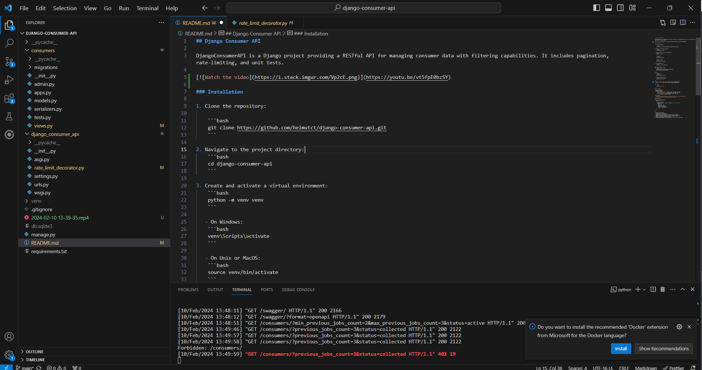

## Django Consumer API

DjangoConsumerAPI is a Django project providing a RESTful API for managing consumer data with filtering capabilities. It includes pagination, rate-limiting, and unit tests.

Click in the image below to download the video.

[](video.mp4)

### Installation

1. Clone the repository:

    ```bash
    git clone https://github.com/helmutct/django-consumer-api.git
    ```

2. Navigate to the project directory:
    ```bash
    cd django-consumer-api
    ```

3. Create and activate a virtual environment:
    ```bash
    python -m venv venv
    ```

   - On Windows:
    ```bash
    venv\Scripts\activate
    ```

   - On Unix or MacOS:
    ```bash
    source venv/bin/activate
    ```

4. Install dependencies:
    ```bash
    pip install -r requirements.txt
    ```

### Project creation
Only for the project creation
    ```bash
    django-admin startproject django_consumer_api
    python manage.py makemigrations
    ```

### Usage

1. Run migrations:
    ```bash
    python manage.py migrate
    ```

2. Start the development server:
    ```bash
    python manage.py runserver
    ```

Urls:
 - [http://127.0.0.1:8000/consumers](http://127.0.0.1:8000/consumers).
 - [http://localhost:8000/swagger/](http://localhost:8000/swagger/).

### Tests

    ```bash
    python manage.py test
    ```

### API Endpoint

Filtering Consumers
- Endpoint: /consumers
- Allowed Parameters:
    - `min_previous_jobs_count`: Minimum number of previous jobs held.
    - `max_previous_jobs_count`: Maximum number of previous jobs held.
    - `previous_jobs_count`: Exact number of previous jobs held.
    - `status`: Status of the debt collected.

Sample Requests:
1. `GET /consumers?min_previous_jobs_count=2&max_previous_jobs_count=3&status=active`
2. `GET /consumers?previous_jobs_count=3&status=collected`

Expected Response:
{
  "type": "FeatureCollection",
  "features": [
    {
      "type": "Feature",
      "geometry": {"type": "Point", "coordinates": [-111.92,33.45]},
      "properties": {
        "id": "4",
        "amount_due": 1001,
        "previous_jobs_count": 1,
        "status": "in_progress",
        "street": "346 Euclid Wl"
      }
    },
    ...
  ]
}

### Minimum Requirements
1. Endpoint URL: /consumers
2. Response Format: Valid GeoJSON.
3. Filtering: Correctly filter any combination of API parameters.
4. Datastore: Utilize a datastore to store and retrieve consumer data.
5. Pagination: Implement pagination via web linking (RFC 5988).
6. Tests: Include tests for the API endpoint.
7. Rate-Limiting: Implement some level of rate-limiting to control API usage.